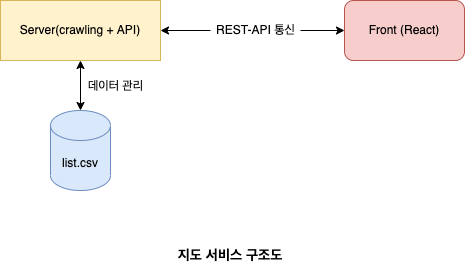

## 배경

네이버 지도를 기반으로 지도 서비스를 개발 하시려는 분들께 도움을 드리고자 글을 써보려고합니다!
현재 구글에 **지도 서비스 만들기** 로 검색 했을 때, 카카오 지도 크롤링 관련해서는 어느정도 검색결과가 나오는 편이지만,
네이버 지도는 검색결과가 적어 정보를 얻기 힘듭니다. 또한 리액트에서 네이버 지도 연동과정에서 주로 다뤄지는 [react-naver-maps](https://www.npmjs.com/package/react-naver-maps)는 간단한 기능으로 구성되는 지도서비스를 만들기에는 나쁘지 않은 라이브러리일 수 있지만, 지도에 다양한 기능(커스텀 클러스터, 지도 이벤트 핸들링)이 있어야 할때는 javascript 기반 [네이버 지도 API](https://navermaps.github.io/maps.js.ncp/docs/)를 사용해야 합니다.
그래서 데이터 크롤링과 지도를 표시해줄 프론트 모두 **네이버 지도**를 기반으로 한 사이드 프로젝트를 진행하며 여러 회차에 걸쳐
포스팅해보려고합니다:)

## 1. 진행해볼 사이드 프로젝트 설명

> 연세대학교 신촌캠퍼스 맛집 지도 🗺

1. 네이버 지도(v5)에 '연세대학교 신촌캠퍼스 맛집'을 검색하고 데이터를 추출하는 플라스크(Flask) 크롤링서버를 구축한다.
2. 크롤링서버에서 추출한 데이터를 데이터베이스에 저장한다.
3. 프론트의 요청에 맞게 API서버에서는, 지도 데이터를 프론트에 전달한다.
4. 전달받은 지도 데이터를 기능에 맞게 화면에 보여준다.

## 2. 개발 환경 구성



- Back-end

  - 크롤링 서버: Python Flask
  - API 서버: express.js
  - DB: sqlite3

- Front-end
  - React
  - typescript

백엔드는 2개의 서버로 이루어집니다. 실제 네이버 지도(v5)검색 데이터를 크롤링하기 위한 파이썬 서버인 Flask와 프론트에서 요청할 지도 데이터를 CRUD할 API 서버로 이루어집니다.
프론트엔드는 자바스크립트 기반 프레임워크인 리액트로 구성되고, 언어는 타입스크립트로 작성합니다.

다음 포스팅에서는 크롤링 서버 환경을 구축하고 크롤링시에 알아두면 좋은 정보들을 실제 코드 작성이전에 소개드리겠습니다.

### 자세한 코드는 [여기](https://github.com/jeongyunjae/yonsei-univ-matjip/tree/master/backend-crawling)에
```toc

```
