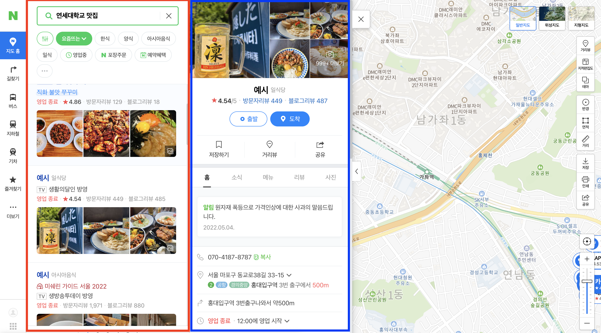

안녕하세요:) 이번 포스팅에서는 파이썬 라이브러리인 플라스크에서 동작하는 네이버 지도 크롤링 서버 환경을 구축해보려고 합니다. 또한 지난 소개(1탄) 포스팅에서 말씀드린 것처럼, 크롤링 진행시 고려해보면 좋은 덕목과 크롤러 시점에서 본 네이버 지도의 특징을 소개해보려고 합니다.

<br />
<br />

## 1. 크롤링 서버환경 구축

(이 포스팅 시리즈는 mac os를 기준으로 작성되었습니다.)
<br />

먼저, 파이썬이 설치되어 있지 않으면 파이썬을 설치해줍니다.
(침고 링크: https://programmers.co.kr/learn/courses/2/lessons/48)
파이썬 버전확인(3.4이상 필요)

```
python --version
```

<br />
<br />

- 파이썬 가상환경 구축
  해당 프로젝트에서만 귀속되게 라이브러리를 설치하기 위해 venv가상환경을 구축해 줍니다.

```
pip install virtualenv //설치
virtualenv 폴더이름 //생성
source 폴더이름/bin/activate //접속
```

<br />
<br />

- 필요한 라이브러리 설치
  크롤링에 필요한 라이브러리 목록입니다.
  현재는 필요한 라이브러리가 몇가지 없어 직접 pip install명령어를 통해 설치를 진행하지만 db연결, 스케줄러 설정 등이 추가된다면 설치해야할 라이브러리가 많아집니다.
  이때는 requirements.txt파일에 설치할 라이브러리를 명시해두고 한 번에 설치하여 라이브러리 설치 및 버전 관리를 하는 것이 좋습니다.

```
pip install flask beautifulsoup4 selenium webdriver-manager
```

<br />
<br />

### 설명

- flask: 파이썬 웹 프레임워크로, 크롤링 서버 구축 틀
- beautifulsoup4: html parser로, 웹페이지 크롤링시, html태그를 효과적으로 추출하기 위함
- selenium: 자바스크립트가 동적으로 생성한 데이터를 크롤링하기 위함, 마우스, 키보드 등 이벤트 핸들링을 쉽게 위함
- webdriver-manager: 크롤링을 시도할 웹 브라우저인 크롬을 컨트롤하기 위함

<br />
<br />

## 플라스크 서버 실행

### app.py

```python
import argparse
from flask import Flask

# 실행 환경변수 설정
parser = argparse.ArgumentParser()
parser.add_argument('--env',required=False, default='development')
args = parser.parse_args()

# flask app 생성
app = Flask(__name__)

if __name__ == '__main__':
  app.run(host='0.0.0.0', port='3060', debug=True, use_reloader=True)

```

<br />

In terminal

```
python app.py
```

<br />
<br />

## 2. 크롤링시 알아두면 좋은 3가지 요소

- 예상치 못한 상황에 대한 전처리 진행
- sleep의 필요성
- Iframe간 이동

<br />

### 예상치 못한 상황에 대한 전처리 진행

웹페이지 크롤링을 하다보면 생각지도 못한 부분에서 동작이 멈추거나 에러가 발생하여 강제종료되는 일이 종종 발생합니다. 많은 이유가 있지만, 크게 3가지 상황이 발생합니다.

1. ul > li 내부에서 서로다른 가변적 데이터가 생성될 때
2. 웹사이트 내부 html 태그의 형식이나 이름이 변경되었을 때
3. 네트워크 통신이 불안정하여 로딩시간이 길어질때나 끊켰을 때
   위 상황에서 일단 크롤링이 계속 진행되어 작성해둔 반복문을 일단 끝까지 돌리거나 다음 항목으로 넘어가는 예외처리를 해주어야 합니다. 따라서 크롤링코드는 주기적으로 돌려보며 여러가지 실패 케이스를 찾아내고, 예외처리를 해주는 것이 바람직합니다.

<br />

### sleep의 필요성

코드를 작성하고 크롤링 서버를 실행시켰을 때, 실제 코드 실행 속도와 웹 서버의 데이터 전송 시간 차이로 인해 런타임오류가 발생할 때가 존재합니다.
이는, 브라우저 렌더링 엔진에 의한 html 파싱이 이루어 지기 전에, 이미 beautifulsoup에서 html을 parser하기 때문입니다. 이 경우 파이썬 내부함수인 time의 모듈 중 코드 실행 지연 모듈은 sleep()을 통해 실제 코드 실행속도를 웹서버와 맞추는 것이 해결책 중 하나가 됩니다. 이때, time.sleep()함수로 지연할 시간은 코드를 실행시켜보며 적절한 시간에서 조금 널널한 시간(+1~3초)을 설정해 놓는 것을 추천 드립니다.

<br />

### Iframe간 이동

Iframe은 HTML inline Frame 요소로, 하나의 사이트에 2개 이상의 페이지를 삽입할 수 있습니다.
<br />



네이버 지도에서는 현재 위 사진처럼 총 2개의 Iframe이 삽입되어 있습니다.

<br />

- 빨간색 테두리: 검색 및 결과 섹션 Iframe
- 파란색 테두리: 검색 상세 섹션 Iframe
  이렇게 한 사이트에 여러 Iframe이 존재하여 Iframe간 html 태그 선택을 넘나들때, Iframe 전환을 해줘야 합니다. Iframe 전환은 위에서 소개한 webdriver의 모듈 중에 switch_to 내부함수로 할 수 있습니다. Iframe 전환은 실제 크롤링을 진행해볼 다음 포스팅에서 자세히 살펴보겠습니다.

<br />
<br />

## 3. 다음 포스팅 미리보기

다음 포스팅에서는 네이버 지도에서 키워드를 통한 지역 검색을 진행한 뒤, 검색결과 데이터 크롤링으로 하는 과정을 거쳐보겠습니다.

<br />

### 자세한 코드는 [여기](https://github.com/jeongyunjae/yonsei-univ-matjip)에

```toc

```
