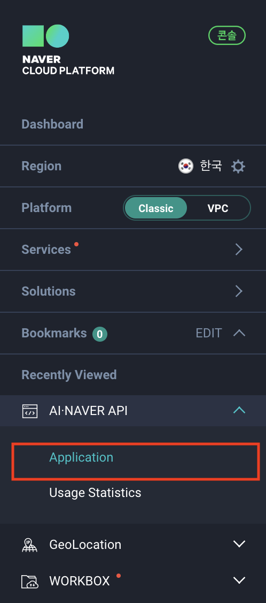
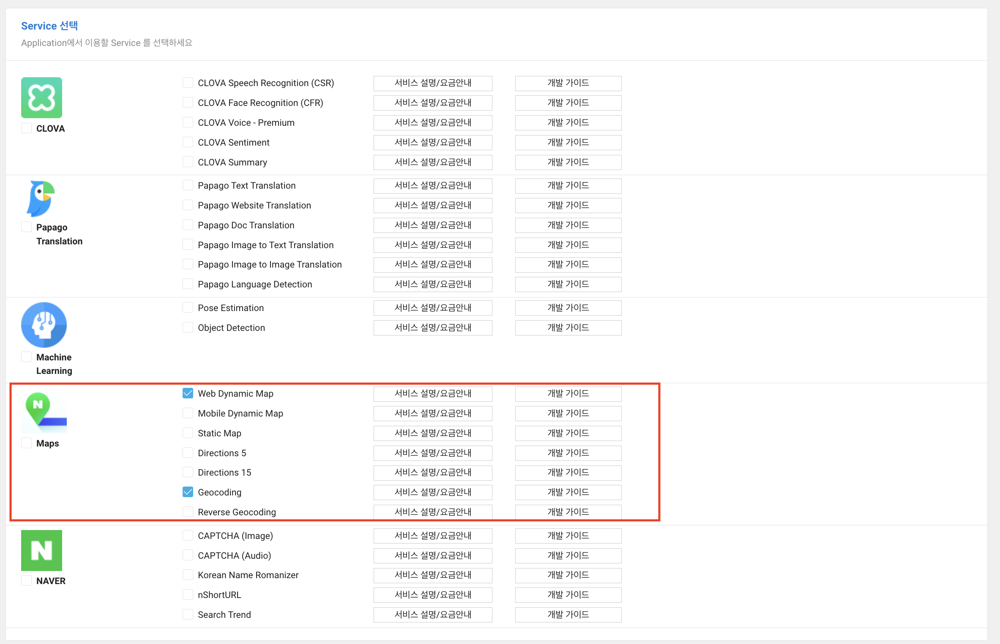
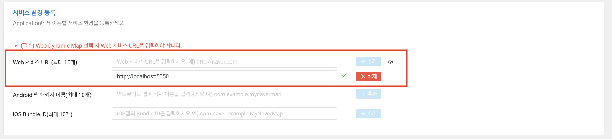
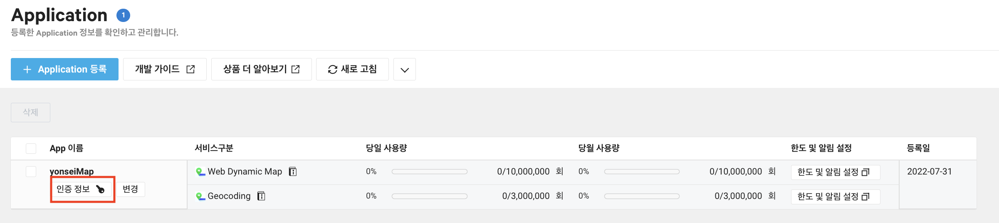

<h3>
안녕하세요 :)
<br />
<br />
이번 포스팅에서는 지난 시간에 이어, 매장 주소로부터 위도 경도를 추출하기 위한 Naver Geocoding 세팅을 진행해보겠습니다.
</h3>

<br />

## 1. NAVER CLOUD PLATFORM로부터 어플리케이션 등록

오른쪽 상단에 보시면 로그인이 있습니다. (저는 로그인한 상태라 로그아웃으로 보입니다)

여기서 네이버 클라우드 플랫폼 전용 아이디를 회원가입 해줍니다.


<br />

계정이 없으면 로그인 한 뒤, NCP콘솔로 이동합니다.
NCP콘솔에서 아래 사진에 있는
<br />
AI-NAVER API -> Application 탭을 눌러줍니다.



<br />
<br />
<br />

아래 사진에 보이는 파란색 어플리케이션 등록 버튼을 눌러줍니다.
<br />


<br />
<br />
<br />

버튼을 누르고 들어간 뒤, 아래 3가지 항목을 입력 및 선택해주면 됩니다.

<br />

### 사용할 어플리케이션 이름


원하는 이름으로 지어주면 됩니다!

<br />
<br />

### 사용할 서비스 선택



여러가지 선택항목들이 있을텐데 우리는 2개만 선택하면 됩니다!

- Web Dynamic Map: 지도서비스를 만들기 위해 기본 네이버 지도형태 import
- Geocoding: 백엔드에서 실제 주소를 기반으로 위, 경도 뽑아내기

<br />
<br />

### 서비스 환경 등록

만들고자하는 어플리케이션이 사용될 웹 URL을 입력해주면 됩니다.
저희는 현재 로컬에서 동작시키고자 하기 때문에 http://localhost:포트이름
으로 작성한 뒤, 추가해주면 됩니다.

<br />



  <br />

마지막으로 아래 등록버튼을 눌러, 지도서비스 어플리케이션 등록을 완료해주면 됩니다!

<br />
<br />

## 2. 크롤링 서버에 Geocoding 연결

어플리케이션 등록이 완료되었으면 이제 크롤링서버에서 실제 주소로 위, 경도를 뽑아볼텐대요.
<br />
설정에 앞서, 크롤링서버 최상단 디렉토리에 `.env`파일을 만들어 NCP연결에 필요한 계정정보를 입력해주면 됩니다.

`.env`

```
# naver geocoding
CLIENT_ID=이곳에 CLIENT_ID입력
CLIENT_SECRET=이곳에 CLIENT_SECRET 입력
```

<br />

CLIENT_ID와 CLIENT_SECRET은 아래 사진에서 볼 수 있는 '인증 정보' 버튼을 눌러 확인하시면 됩니다!
<br />



<br />

## 3. 다음 포스팅 미리보기

다음 포스팅에서는 geocoding 연결을 확인하고, 실제 주소를 위, 경도로 바꿔보는 시간을 가져보겠습니다

<br />

### 자세한 코드는 [여기](https://github.com/jeongyunjae/yonsei-univ-matjip)에

```toc

```
