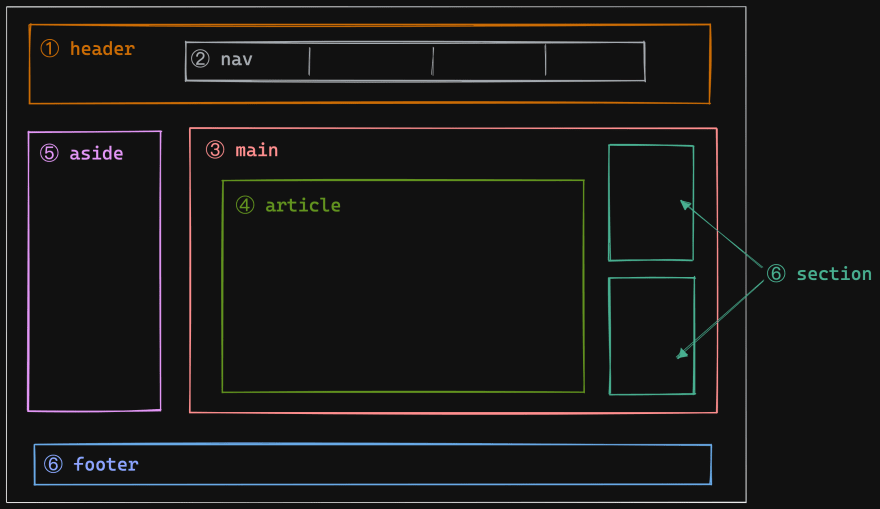

## 개요
최근에 웹 구현관련 코딩테스트 문제에서 시맨틱태그를 다루는 걸 접했는데, 생각보다 의미론적이나, 사용형태에서 몰랐던 부분이 여럿 있었습니다.
또한 여러 회사의 프론트엔드 채용공고에서도 시맨틱태그 관련 사항들을 왕왕 접하게 되어 시맨틱태그를 디테일하게 사용해보면 어떨까해서 포스팅하게 되었습니다.

<br />

## 시맨틱 태그란?
시맨틱 태그란 말그대로 의미의(semantic) 태그(tag)입니다. 즉, div, span처럼 여타 다른 태그들과 달리 태그만 보고도 이게 뭐에 쓰인
태그인지 알 수 있는 태그를 말합니다. 


흔히 볼 수 있는 시맨틱 태그 레이아웃 이미지
<br />
<br />

## 왜 써야할까?
시맨틱 태그를 왜 써야할까요? 일반적으로 HTML태그로 레이아웃을 잡을 때, div태그로 나누면서 해도 코드레벨에서 전혀 문제가 되지 않습니다. 또한
div태그로 작성하면 내리 블록형태로 코드를 작성해나가면서, 레이아웃 형태에 큰 고민없이도 뷰를 보일 수 있죠.
하지만 시맨틱 태그를 사용하면 크게 2가지 이점이 있습니다.

<br />

<h3>첫째, SEO에 아주 좋다</h3>
SEO(Search Engine Optimization)는 브라우저 검색엔진에서 상위에 표시되기 위해 최적화하는 것을 말합니다.
누구나(어느 회사든) 자신의 사이트가 검색결과에서 후순위에 배치되는 걸 원하지 않습니다.
따라서 어떤 방법을 써서든 검색결과 상위에 링크시켜야하는데, 이 과정중 <b>시맨틱태그</b>가 큰 역할을 합니다.
브라우저의 검색엔진은 로봇(Robot)이라는 프로그램을 이용하여 전세계의 웹사이트를 크롤링(수집)합니다.
로봇이 크롤링할때는 해당 사이트가 어떤 컨텐츠를 가지는지 유심히 살펴봅니다. 이때, 컨텐츠 의미파악에 유일한 방법이
해당 사이트의 HTML태그를 분석하는 것입니다. 이 부분에서 시맨틱태그는 여기가 어떤 역할을 하는 태그이고, 어떤 구조로 이루어져있는지
검색엔진의 로봇에게 알려주는 역할을 하게됩니다. 그 결과 사이트는 로봇에게 의미(semantic)있는 정보를 전달하여 더욱 효과적인 크롤링과
인덱싱을 가능케합니다.
<b>즉, 시맨틱 태그를 활용하면 브라우저 검색엔진에게 질좋은 정보를 제공하여, SEO에 큰 도움을 줍니다</b>
<br />
<br />
<h3>둘째, 다른 개발자가 이해하기 좋다</h3>

웹 사이트를 개발할 때, 혼자하는 경우도 있지만 대부분 다른 개발자와 함께 개발합니다.
여럿 이유로, 다른 개발자가 짜놓은 코드를 볼때가 자주 있는데 이때 div태그로 범벅이 된 코드를 보면 어질어질합니다(저만 그런가요..?)
여기서 시맨틱 태그가 밫을 발합니다.

<br />
<b>시맨틱 태그 적용 전</b>

```html
<div>
  <div>
    <p>제목</p>
      <div>
        <p>메뉴1</p>
        <p>메뉴2</p>
        <p>메뉴3</p>
      </div>
  </div>
  <div>
    <div>
      <p>내용1</p>
    </div>
    <div>
      <p>내용2</p>
    </div>
  </div>
  <div>
    <p>footer</p>
  </div>
</div>
```
<br />

<b>시맨틱 태그 적용 후</b>
```html
<body>
  <header>
    <p>제목</p>
      <nav>
        <p>메뉴1</p>
        <p>메뉴2</p>
        <p>메뉴3</p>
      </nav>
  </header>
  <main>
    <section>
      <article>내용1</article>
    </section>
    <section>
      <article>내용2</article>
    </section>
  </main>
  <footer>
    <small>footer</small>
  </footer>
</body>
```
<br />
어떤가요? 코드만 딱 봤을때, 시맨틱 태그를 활용한 코드가 더 사이트 구조를 이해하기 쉬운편입니다.

<br />
<br />

## 유용한 태그 종류
유명한(검색했을때 자주나오는)시맨틱 태그말고, 유용하지만 잘 알려지지 않은 태그 몇가지를 소개 해보려고 합니다.

<br />

`<address>` : 보통 `<footer>`태그 내부에서 회사주소, 집주소와 같이 주소를 표기할때 사용하는 태그

```html
<footer>
  <address>경기도 성남시 분당구 판교역로34</address>
</footer>
```
<br />

`<small>` : `<address>`태그와 마찬가지로 `<footer>`태그 내부에서 저작권 등을 표시하는 태그

```html
<footer>
  <small>COPYRIGHT © 회사. Proudly created</small>
</footer>
```
<br />

`<mark>`: 시각적으로 또는 의미론적으로 강조를 하고싶은 부분에 적용하는 태그입니다. 

```html
<article>
  <p>
  다른 부분은 크게 중요하지 않지만 
    <mark>이 부분은 아주 중요해요!</mark>
  </p>
</article>
```
<br />

`<pre>` : 이 태그는, 텍스트를 표현할 때, 개행이나 들여쓰기 등을 임의로 적용시킬때 사용하면 편한 태그입니다.
```html
<article>
  <pre>
    pre 요소 띄어쓰기해보자   띄어쓰기 
    아래는 줄바꿈
    
    띄어쓰기 여러번     tab여러번     결과 
  </pre>
</article>
```

<br />


```toc

```
